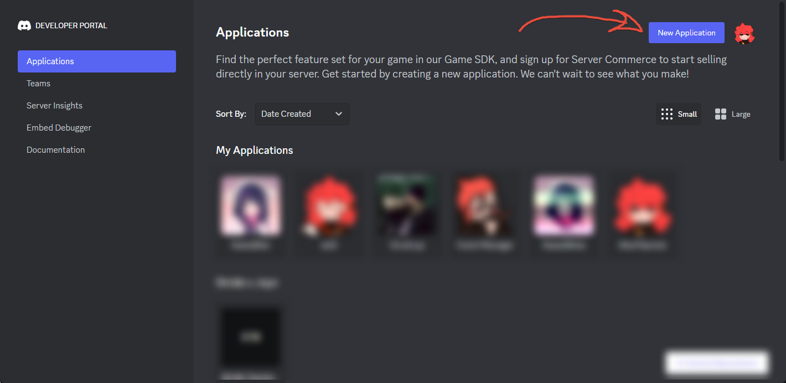
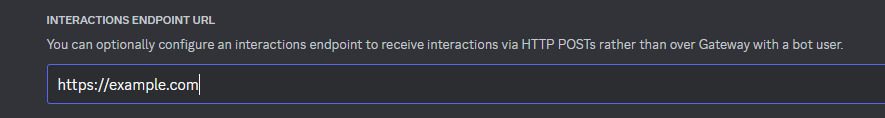
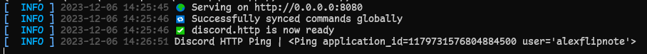

Getting started
===============
``discord.http`` is built around Discord's HTTP interactions.
Instead of keeping a connection open, Discord sends every slash command, button click and modal submit
to your bot as an ``HTTP POST`` request, which your bot then answers.
When you need more, like knowing when a message is sent or a member joins,
the gateway (websocket) can be turned on alongside it.

How your bot connects
---------------------
On boot, the library checks your bot's "Interactions Endpoint URL" and your ``intents``,
then logs which of these modes it runs in:

.. list-table::
  :header-rows: 1

  * - Mode
    - Interactions
    - Gateway events
    - When
  * - ``HTTP``
    - Over HTTP
    - None
    - The endpoint URL is set
  * - ``HTTP+WS``
    - Over HTTP
    - Yes
    - The endpoint URL is set, with ``intents``
  * - ``WS``
    - Over the gateway
    - None
    - No endpoint URL, and no ``intents``
  * - ``WS+``
    - Over the gateway
    - Yes
    - No endpoint URL, with ``intents``

The HTTP server starts in every mode, unless ``disable_http_server=True`` is passed to the client.

The HTTP modes are recommended, the first reply to a command is sent back on the same request
and no connection has to be kept open just to answer commands.
The WS modes need no public HTTPS endpoint, which is great for local development, see :ref:`ws-mode` below.

Requirements
------------

Python
~~~~~~
First of all you need Python to be installed, you can get `python here <https://www.python.org/downloads/>`_.
We recommend that you use Python 3.11 or higher, lower versions may not work.

After that, you need to install the library, you can do so by using ``pip install discord.http`` in the terminal.

.. note::
  Some systems might have ``pip3`` instead of ``pip``, if that is the case,
  use ``pip3 install discord.http`` instead. In some rare cases if that does not work,
  try ``python -m pip install discord.http`` or ``python3 -m pip install discord.http``.

Discord bot
~~~~~~~~~~~
If you do not have a bot already on Discord, next step is to create one. (Can also use an existing bot if you have one)
You can do so by going to the `Discord developer page <https://discord.com/developers/applications>`_.



After that, copy the bot's token from the bot page, it is the only thing the client needs.
The application ID and public key are fetched automatically when the bot boots.
You will still need the application ID to invite the bot, as shown below.

.. note::
  Make sure you copy the application ID, not the client ID.
  There is a difference between the two, notably when it comes to older bots that have two different IDs.

To invite the bot to your or other servers, you will need something called an OAuth2 URL.
Creating one for your own bot can be done by using this URL:

.. code-block::

  https://discord.com/oauth2/authorize?client_id=APPLICATION_ID&scope=bot+applications.commands

When running over HTTP only, the bot will appear to be "offline" on your server, even while it is running.
This is due to the fact that the bot is not using the websocket, which is what makes the bot appear online.
However you are able to use the bot as normal, and it will respond to slash commands and other interactions.

.. note::
  Make sure to replace ``APPLICATION_ID`` with the actual application ID of your bot.

HTTP Server
~~~~~~~~~~~
Needed for the HTTP modes, and to save the "Interactions Endpoint URL",
as Discord verifies it against your running bot first.
Depending on the approach you take, there are multiple ways to host the HTTP server.
For local testing, you can use `ngrok <https://ngrok.com/>`_,
which is a tool that allows you to expose your local server to the internet.

Planning to host this in a server on production scale?
You can use `Apache2 <https://httpd.apache.org/>`_ or `NGINX <https://www.nginx.com/>`_.
For beginners, Apache2 is a nice way to get introduced to hosting, however we recommend
using NGINX due to its performance overall and its ability to handle more requests.

.. _ws-mode:

No HTTPS endpoint? (WS mode)
~~~~~~~~~~~~~~~~~~~~~~~~~~~~
Hosting a public HTTPS endpoint is recommended, but not required.
If the "Interactions Endpoint URL" in your bot's application page is left empty,
Discord sends interactions over the gateway instead, and the library detects this on boot:

- The gateway is enabled automatically to receive interactions, with a warning in the log
- The HTTP server still starts, so the URL can be set at any time,
  Discord sends a request to it to verify it before saving it
- Your commands do not change, ``return ctx.response.send_message(...)`` works the same way

Not planning to use an HTTP endpoint at all? Pass ``disable_http_server=True`` to the client
to run on the gateway alone, without starting the HTTP server.

This is great for local development and for bots that do not want to deal with hosting,
but it does give up what makes HTTP mode lean:

- The first reply to a command costs an extra request to Discord, so it is slightly slower
- The bot needs a gateway connection running at all times

.. note::
  The automatically enabled gateway connects without any intents, which is all interactions need.
  If you also want gateway events, like ``message_create``, pass your desired ``intents``,
  see :ref:`discord.http/gateway <gateway-section>` below.

Quick example
-------------
After installing everything, you can make a very simple ``/ping`` bot with the following code:

.. include:: ../../README.md
  :start-after: <!-- DOCS: quick_example -->
  :end-before: ```
  :literal:


By default, the library will be hosting on ``127.0.0.1`` to prevent external access
while using the port ``8080``. You're free to change it to your liking, but be careful
if you choose to use ``0.0.0.0`` and only use it if you know what you are doing.

If you wish to change the default behaviour, you can do so by using the ``host`` and ``port`` parameters in the Client.start()

.. code-block:: python

  client.start(
      host="127.0.0.1",
      port=8080
  )

.. note::
  ``127.0.0.1`` is the same as ``localhost``, so only you can access it locally or through a reverse proxy.

  ``0.0.0.0`` means that you wish to broadcast the HTTP server to the internet, which is not recommended if you are not using a reverse proxy.

After booting up your bot, next step will be to register the chosen URL
in to your `bot's application page <https://discord.com/developers/applications>`_.
Inside the bot configuration page, you will see a section called "Interactions Endpoint URL",
paste your URL there and save the settings.

The URL you paste in there is the root URL, there's no need to add ``/interactions`` or similar to the end of it.
So if your domain is ``example.com``, you put that inside the bot's interaction URL setting.



.. note::
  If the page refuses to save, it means that your bot is not running or not exposed to the correct URL.
  Discord attempts to ping with the URL you provided, and if it fails, it will not save.
  This is also why the HTTP server keeps running when no URL is set yet, unless ``disable_http_server=True`` is used.

  If the Discord developer page saved successfully, you should see your bot printed an ``[ INFO ]`` message
  telling what has happened. This simply means that you did it all correctly and can now start using the bot.

After all these steps, you should see the following in your terminal:



This what the ``[ INFO ]`` messages mean:

1. Telling you where the bot is broadcasting to, when it comes to the host and port.
2. Showing if the bot has successfully synced commands with Discord API (it will not show if you have syncing disabled).
3. Showing that the bot is now ready to receive interactions from Discord API.
4. Confirming that the URL you provided in the bot's application page is correct, working and Discord API can reach it.

Offline mode
------------
Not every job needs a running bot. ``Client.offline_run()`` logs in, runs your function once and then exits,
without starting the HTTP server or connecting to the gateway, so none of the hosting steps above are needed.
This is great for cron jobs, one-off scripts and admin tools:

.. include:: ../../README.md
  :start-after: <!-- DOCS: offline_example -->
  :end-before: ```
  :literal:

Keep in mind that offline mode can only talk to the Discord API, it does not receive any interactions or events.

Python logging
--------------
The library uses Python's built-in logging module to log messages.
If you want to use it to have the same output as the library, you can do so by using the following code:

.. code-block:: python

  import logging

  _log = logging.getLogger("discord_http")
  _log.info("Hello World!")

By default, the library runs in the ``INFO`` logging level, which means you can use all the default logging levels except ``DEBUG``.
However if you do want to use ``DEBUG``, you can do so by setting the logging level directly in the Client:

.. code-block:: python

  import logging

  client = Client(
      ...
      logging_level=logging.DEBUG
  )

.. note::
  Be aware that enabling ``DEBUG`` logging level will produce a lot of output since discord.http uses it extensively for debugging purposes.
  It is recommended to only use it for debugging purposes and not in production.


.. _gateway-section:

discord.http/gateway
--------------------

If you want to use the gateway, pass the ``intents`` you need to the Client, which starts it

.. code-block:: python

  from discord_http.gateway import Intents

  client = Client(
      ...
      intents=Intents.guild_messages
  )

.. note::
  Sharding is done automatically by the library, so you do not have to worry about that.
  It also uses ``max_concurrency`` automatically to determine how many shards to launch at once to speed up the boot process.


Intents
~~~~~~~
By default, there are no intents enabled, which means you would have a gateway, but it would essentially do nothing.
You can use the :class:`Intents` flag to enable certain events that you desire to listen to.


.. warning::
  Some intents does require extra permissions if you are using a verified bot, such as ``message_content``, ``guild_members`` and ``guild_presences``.
  If you do not have the required permissions, the library will raise an exception when you try to start the bot.

  You can check `Privileged Intents <https://discord.com/developers/docs/events/gateway#privileged-intents>`_ for more information.

.. code-block:: python

  from discord_http.gateway import Intents

  client = Client(
      ...
      intents=(
        Intents.guilds |
        Intents.guild_members |
        ...
    )
  )

Cache
~~~~~
By default, cache is completly disabled, this is an opt-in feature.
You can use the :class:`GatewayCacheFlags` flag to enable certain cache flags as you desire.
Mostly this is useful if you wish to reduce the amount of data needing to be requested from Discord API.

Goal of this is to make sure that you are in full control of what you want to cache and what not.
Not to mention that this will also reduce the amount of RAM usage, as the library will not cache everything by default.

.. code-block:: python

  from discord_http.gateway import GatewayCacheFlags

  client = Client(
      ...
      gateway_cache=(
        GatewayCacheFlags.guilds |
        GatewayCacheFlags.channels |
        ...
    )
  )


Hosting examples
--------------------

ngrok
~~~~~
This is the most simple approach to hosting a HTTP server,
however if you plan to use this as a hosting method for production,
you will need to upgrade to their paid plan to get a static URL with no limits.

However for local testing, you can use the free plan, which will give you a randomly generated URL.
You can get `ngrok here <https://ngrok.com/download>`_ and follow the instructions on their website.

After downloading it, you need to open a new terminal and run the command ``ngrok http 8080``.
Keep in mind that the bot has to also run on port 8080, otherwise you will need to change
the port in the command mentioned earlier.

NGINX
~~~~~

.. code-block:: nginx

    # You need to replace example.com with your own domain of choice
    # or remove it if you plan to use IP like http://123.123.123.123 (not recommended)

    # You will also need to change the proxy_pass to whatever local address and port you are using

    # HTTPS Example
    server {
      listen 443 ssl http2;
      listen [::]:443 ssl http2;
      server_name example.com;

      location / {
        proxy_set_header X-Forwarded-For $proxy_add_x_forwarded_for;
        proxy_set_header Host $http_host;
        proxy_set_header X-Forwarded-Proto https;
        proxy_redirect off;
        proxy_pass http://localhost:8080;
        proxy_http_version 1.1;
      }

      ssl on;
      ssl_verify_client on;
    }

    # HTTP Example
    server {
      listen 80;
      listen [::]:80;
      server_name example.com;

      location / {
        proxy_set_header X-Forwarded-For $proxy_add_x_forwarded_for;
        proxy_set_header Host $http_host;
        proxy_set_header X-Forwarded-Proto https;
        proxy_redirect off;
        proxy_pass http://localhost:8080;
        proxy_http_version 1.1;
      }
    }

Apache2
~~~~~~~

.. code-block:: apache

    # You need to replace example.com with your own domain of choice
    # or remove it if you plan to use IP like http://123.123.123.123 (not recommended)

    # You will also need to change both ProxyPass and ProxyPassReverse
    # to whatever local address and port you are using

    # HTTPS Example
    <VirtualHost *:443>
        ServerName example.com

        SSLEngine on
        SSLVerifyClient require

        SSLProxyEngine on
        SSLProxyVerify require
        SSLProxyCheckPeerCN on
        SSLProxyCheckPeerName on
        SSLProxyCheckPeerExpire on

        ProxyPass / http://localhost:8080/
        ProxyPassReverse / http://localhost:8080/

        <Proxy *>
            Order deny,allow
            Allow from all
        </Proxy>

        RequestHeader set X-Forwarded-Proto "https"
        RequestHeader set X-Forwarded-For "%{X-Forwarded-For}e"
        RequestHeader set Host "%{Host}i"

    </VirtualHost>

    # HTTP Example
    <VirtualHost *:80>
        ServerName example.com

        ProxyPass / http://localhost:8080/
        ProxyPassReverse / http://localhost:8080/

        <Proxy *>
            Order deny,allow
            Allow from all
        </Proxy>

        RequestHeader set X-Forwarded-Proto "https"
        RequestHeader set X-Forwarded-For "%{X-Forwarded-For}e"
        RequestHeader set Host "%{Host}i"

    </VirtualHost>
